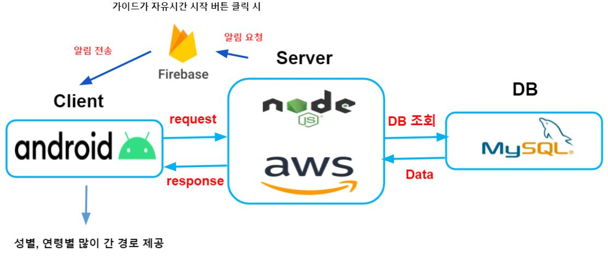

# Travel_Guide_server
패키지 여행 시, 자유시간 동안 <br/>
앱으로 길 잃음 방지를 위한 그룹원 위치 조회 기능 <br/>
웹에서 가이드에게 쌓인 위치 데이터 분석 정보를 제공합니다.

* 주요기능
  - 패키지 상품 가이드 간 공유
  - 그룹 여행객 실시간 위치 파악
  - 자유시간이 있는 장소에서 여행객들 성별, 나이별로 이동 경로 추천(여행객이 사용)
  - 패키지 여행을 계획하는데 가이드에게 도움을 주기 위한 분석용 웹(가이드가 사용)

## install
```
git clone https://github.com/nayeonkiim/Travel_Guide_server.git
npm install
npm start
```

## 기술 스택


* Node.js & express
* 데이터베이스: MySQL
* ORM : sequelize
* 서버 구축: AWS EC2
* 토큰 저장: FireBase token
* 시각화: d3.js
  * 막대 차트, 선 차트, 표
* kakao map api

## 서비스 소개 및 시연
* 웹을 통한 성별,연령별 많이 간 경로 및 전체 모니터링
<br/>
* 앱을 통한 성별,연령별 많이 간 경로


## database


## Client Android
[Travel_Guide_Client](https://github.com/HyeRim-Choi/Travel_Guide_Client)
